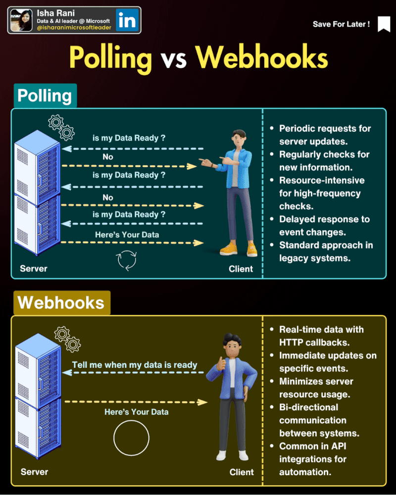

# Front-End-Interview-Questions

### 1. How to improve website performance: faster loading tips

<b>Answer</b>

#### 
1. Use a Content Delivery Network (CDN) ...
2. Move your website to a better host. ...
3. Optimize the size of images on your website. ...
4. Reduce the number of plugins. ...
5. Minimize the number of JavaScript and CSS files. ...
6. Use website caching. ...
7. Implement GZIP compression.
8. Reduce the use of web fonts.

---

### 2. Polling vs webhooks

<b>Answer</b>

#### 

Polling and webhooks are two different approaches to obtain real-time data updates in software systems. Polling involves repeatedly checking a server or endpoint for updates at specified intervals. While it's straightforward, it can be inefficient and may lead to unnecessary resource usage. In contrast, webhooks enable the server to notify a client whenever there is new data available, reducing the need for constant polling and improving efficiency. Webhooks are more responsive and scalable, making them a preferred choice for real-time applications and reducing network traffic compared to traditional polling mechanisms.

polling is ideal in situations where continuous updates are expected. Like live monitoring dashboards for stock marketing for example.📉 📈
  Here’s to my fresher network.
  **Imagine you're waiting for a package to be delivered to your house:**
  
  1. **Webhooks**:
   - Webhooks are like having a special bell that rings at your door, and the delivery person pushes it whenever they arrive with a package. You don't have to keep checking the door; you'll instantly know when the package is there.
  
  2. **Polling**:
   - Polling is more like you constantly going to the window and looking outside to see if the delivery person is there yet. You might check every few minutes, and if they're not there, you keep checking. It's like you're being more proactive in finding out when the package arrives.

**How polling works**
Polling involves periodically making requests to a system to check for new events or data. If new data is found, a response is returned with the new data in its payload. If no new data is available, nothing is returned.

Polling is used to query systems for new information and can be set up as an automated cron job that runs at certain intervals.

To capture the difference between these two approaches with a relatable example, polling is like going to the post office to check if you have new mail. Using webhooks is basically having mail delivered to your house every time you have new mail simply by giving the postman your house address.

**When to use polling**
Polling can be used when you don't need real-time updates, which cause frequent changes in data and can crash your system if you decide to receive updates every single time something changes.

Imagine you're running a successful startup and the number of users is growing by a hundred users each second. You want a big screen in the middle of the office to display your current subscriber count. Subscribing for new data each time a new user signs up would be chaos.

What you should do is poll your server every five to ten minutes to fetch the current total number of users. This would be lesser work for your system and ultimately would consume lesser resources.

**How webhooks differ from polling**
Polling uses the pull model of communication where a system pulls information from another system, while webhooks use the push model by pushing information from a source application to a destination application.

Polling requests are made by a client, while webhook requests are made by a server. Webhooks are also automatically triggered when an event occurs, whereas polling is set up to run at fixed intervals and runs whether there is a new event or not.

Polling can be resource-intensive and you need to make calls on whether the efforts will be fruitful or not. This is not the case for webhook requests, which are only made when there is new information.
     

---

### 3. Webhooks

<b>Answer</b>

#### 
How webhooks differ from APIs
Webhooks make calls to APIs. An API provides webhooks with the entry point to push data to an application. When an event occurs in a source application, a webhook request is triggered to one of the API endpoints.

**When to use webhooks**
Now that you have a good understanding of how webhooks and other communication systems work, in what scenarios is it then appropriate to go with webhooks?

Webhooks are a simplified model of communication thus, you should use webhooks when you require the following:

**Real-time one-way communication (from source to destination)**
A non-persistent connection between the two systems' communication
You want to respond immediately to an event from a SaaS application that supports webhooks
You want to use the push model to immediately push updates
The communication is one-to-one
A lot of SaaS applications use webhooks for communication — for example, Shopify uses webhooks to communicate events like when a shopping cart is updated or a sale is made. Stripe uses webhooks to communicate events like account updates, payments, etc.

**Examples of these types of scenarios include:**
1. An e-commerce store notifying your invoicing application about a sale
2. E-commerce stores notifying merchants when a particular item is out of stock
3. Payment gateway notifying merchants about a payment
4. Version control systems notifying team members about a commit to a repository
5. Monitoring systems alerting administrators about an error or unusual activity in a system
6. Synchronizing information across systems — for example when a user changes their email in your HR or CRM system, their email is also changed in the payroll or invoicing system

**Sites that send webhooks for notifications and information sharing**
1. <a href="https://www.twilio.com/docs/usage/webhooks" title="twilio webhook documentation">Twilio webhooks</a> convey information about events such as delivered SMS messages, voice calls, and authentication
2. <a href="https://slack.com/intl/en-ca/help/articles/115005265063-Incoming-webhooks-for-Slack" title="slack webhook documentation ">Slack webhooks</a> post messages from apps into Slack
3. <a href="https://shopify.dev/api/admin/rest/reference/events/webhook" title="Shopify webhook documentation">Shopify webhooks</a> sync with Shopify and execute code when an event takes place in your store
4. <a href="https://stripe.com/docs/webhooks" title="stripe webhook documentation">Stripe webhooks</a> notify your application when an event occurs in your account<!-- --> <!-- -->… there are many more examples.

---

